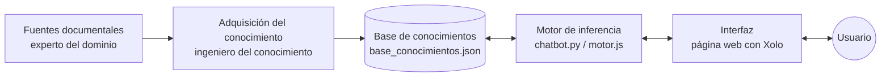

# Xolo, chatbot experto sobre el Día de Muertos

Sistema experto conversacional basado en reglas que responde preguntas sobre el Día de Muertos en México. El personaje es **Xolo**, un xoloitzcuintle: según la leyenda, el perro que guía a las almas al Mictlán.

**Pruébalo en línea:** [Xolo en GitHub Pages]([https://TU-USUARIO.github.io/TU-REPOSITORIO/](https://ximena-tm.github.io/xolochatbot-dia-de-muertos/)) 

Proyecto individual de la materia de Sistemas Inteligentes (unidad de Sistemas Expertos). **El experto del dominio son las fuentes documentales** listadas abajo: el sistema no usa conocimiento externo y cada respuesta indica de qué fuentes proviene.

## Reto

Mucha gente (sobre todo las generaciones jóvenes y quienes nunca han armado una ofrenda) desconoce el significado, el origen y la forma de celebrar el Día de Muertos. Xolo responde estas dudas de forma **consistente y justificada**, y declara cuando no tiene información (por ejemplo, si le preguntas si se celebra en Marte).

## Arquitectura

Sigue la estructura básica de un sistema experto:



| Componente de un SE | En este proyecto |
|---|---|
| Experto del dominio | Las fuentes documentales |
| Ingeniero del conocimiento | La ingeniera extrae y contrasta la información |
| Base de conocimientos | `base_conocimientos.json`: reglas de producción con palabras clave, respuesta y fuentes, más las respuestas de cortesía y del personaje |
| Motor de inferencia | `motor.js` (el que corre en la página web) y `chatbot.py` (la misma lógica en Python, usada para las pruebas automáticas) |
| Interfaz | Página web publicada en GitHub Pages (`index.html`) |

### Cómo razona el motor

1. **Normaliza** la pregunta: minúsculas, sin acentos ni signos, y corrige errores de ortografía comparándola con el vocabulario de la base.
2. **Cortesía:** quita frases como "gracias" o "por favor" para que no estorben. Si la pregunta es solo de cortesía (por ejemplo, "gracias"), Xolo responde con amabilidad.
3. **Filtro de dominio:** si menciona algo ajeno (Marte, la Luna…), responde que no tiene información.
4. **Puntaje:** cada regla suma la longitud de las palabras clave que aparecen en la pregunta (las específicas pesan más).
5. **Selecciona** la regla de mayor puntaje; si no alcanza el umbral (3), responde "sin coincidencia".
6. **Justifica:** devuelve la respuesta junto con las fuentes de la regla.

## Estructura del repositorio

```
.
├── base_conocimientos.json   # reglas, fuentes, personaje y cortesía
├── index.html                # interfaz web con Xolo (la página publicada)
├── motor.js                  # motor de inferencia que usa la página web
├── chatbot.py                # el mismo motor en Python (base de las pruebas)
├── test_chatbot.py           # pruebas automáticas del motor
└── README.md
```

## Uso

**En línea (recomendado):** abre la página publicada con GitHub Pages, escribe tu pregunta o elige una de las sugeridas.

**En tu computadora (opcional):** la página carga `base_conocimientos.json`, así que necesita un servidor local; abrir `index.html` con doble clic no funciona.

```bash
python -m http.server 8000
# abre http://localhost:8000
```

**Pruebas automáticas** (requieren Python 3.8+, sin dependencias externas):

```bash
python test_chatbot.py
```

## Preguntas que responde

| Tema | Ejemplo |
|---|---|
| Definición | ¿Qué es el Día de Muertos? |
| Fechas | ¿Qué día se celebra? |
| Origen | ¿Cuál es el origen del Día de Muertos? |
| Ofrenda | ¿Cómo pongo una ofrenda? · ¿Qué lleva una ofrenda? · ¿Cuántos niveles tiene el altar? · ¿Dónde coloco el altar en mi casa? · ¿Cómo es la ofrenda de los angelitos? |
| Comida | ¿Qué comida se pone en la ofrenda? · ¿Qué es el pan de muerto? · ¿Cómo se hace el pan de muerto? |
| Símbolos | ¿Qué significa el cempasúchil? · ¿Qué significa el papel picado? · ¿Qué son las calaveritas de azúcar? · ¿Quién creó a la Catrina? · ¿Qué es una calavera literaria? |
| Creencias | ¿Qué es el Mictlán? · ¿Quién es el xoloitzcuintle? |
| Contexto | ¿Cómo se celebra en Oaxaca? · ¿Es lo mismo que Halloween? · ¿Es Patrimonio de la Humanidad por la UNESCO? |
| Fuera de dominio | ¿En Marte se hace Día de Muertos? |
| Personaje y cortesía | ¿Quién eres? · Hola · Gracias · Por favor |

## Fuentes (el experto)

| Clave | Fuente |
|---|---|
| INAH | V. J. Santos Ramírez, *El origen del Día de Muertos*, INAH |
| INPI | *Antología: El Día de Muertos entre los pueblos indígenas de México*, INPI, 2020 |
| SRE | SRE-AMEXCID, *Día de Muertos* (elementos de la ofrenda y recetario) |
| INAFED | *Día de Muertos, tradición mexicana que trasciende en el tiempo*, gob.mx, 2019 |
| SADER | *Día de Muertos, la fiesta más emotiva de México*, gob.mx, 2021 |
| UNAM | UNAM, Dirección de CENDI, *Día de Muertos: elementos de la ofrenda* |
| EMBAJADA | Embajada de México en Uruguay, *Día de Muertos*, 2020 |
| CNN | CNN en Español, *¿Cuál es el origen e historia del Día de Muertos?*, 31/10/2025 |
| ECONOMISTA | *El Economista*, *Cómo armar tu ofrenda de Día de Muertos*, 27/10/2024 |
| XOLO | SADER-DGSIAP, *La leyenda del Xoloitzcuintle, el perro azteca*, gob.mx |

### Conocimiento en conflicto

Cuando las fuentes discrepan, el sistema presenta ambas posturas en lugar de elegir una:

- **Origen:** INAFED, SADER y CNN hablan de sincretismo prehispánico-católico; el INAH sostiene que las fiestas del 1 y 2 de noviembre son de origen europeo medieval.
- **UNESCO:** 2003 (proclamación) o 2008 (inscripción en la Lista Representativa).
- **Niveles del altar:** tres (SRE, UNAM) o dos, tres o siete (El Economista).

## Limitaciones

- El método por palabras clave no entiende el significado: una pregunta que mezcla dos temas se resuelve hacia una sola regla.
- Solo cubre lo que dicen las fuentes; fuera de ellas responde "no tengo información".

## Agregar conocimiento

Añade un objeto a `reglas` en `base_conocimientos.json` con `id`, `pregunta_ejemplo`, `keywords` (minúsculas, sin acentos), `respuesta` y `fuentes` (claves de la sección `fuentes`). Agrega un caso a `test_chatbot.py` y corre las pruebas. Las respuestas de cortesía ("gracias", "por favor") están en la sección `cortesia` del mismo archivo.
